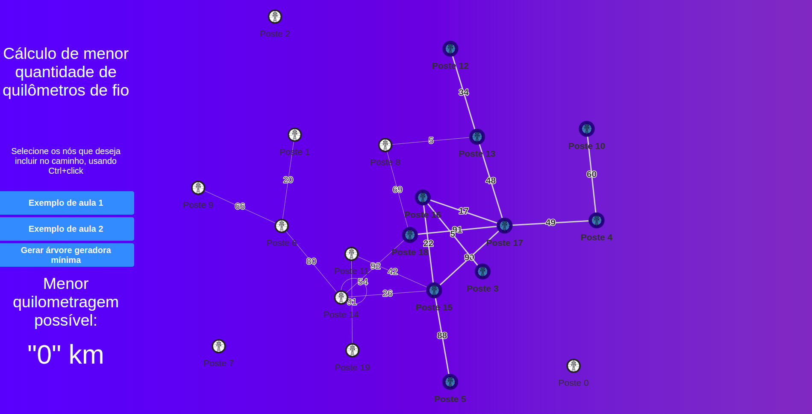
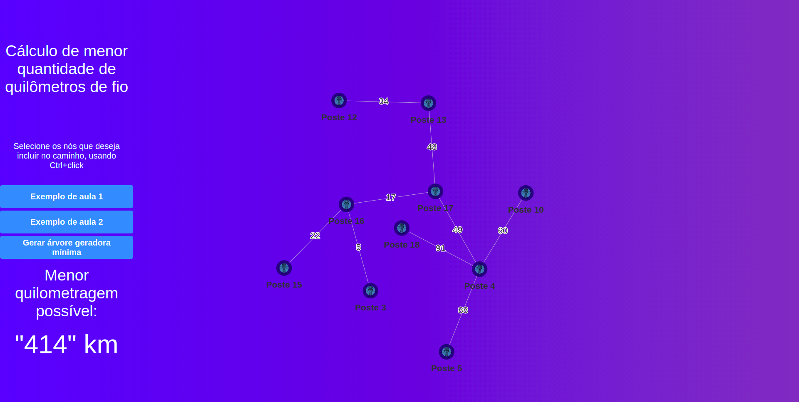
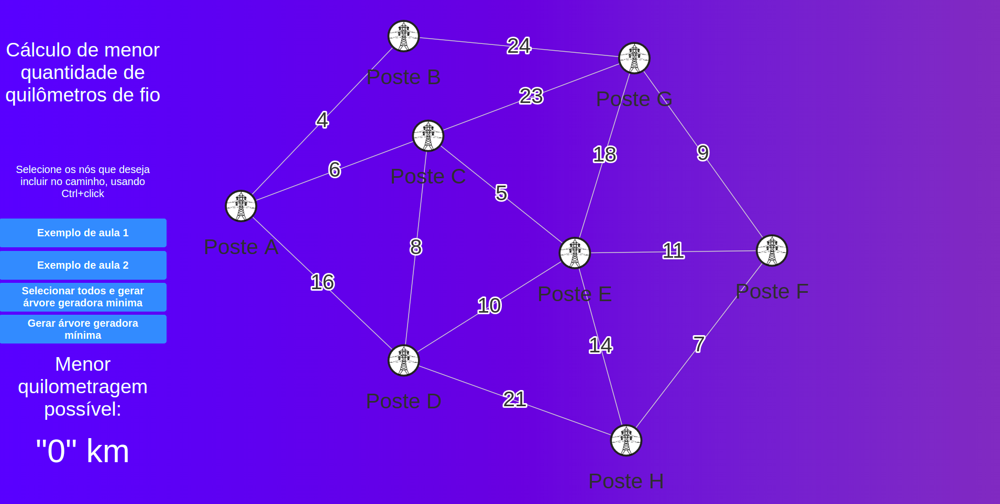
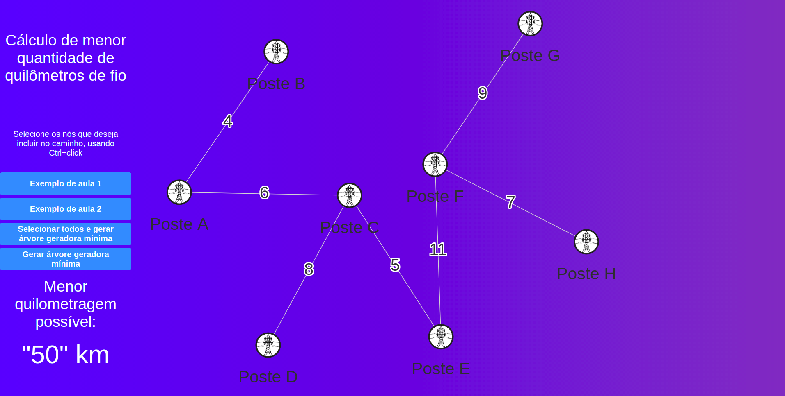
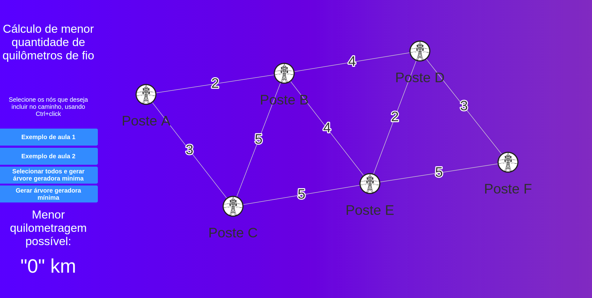
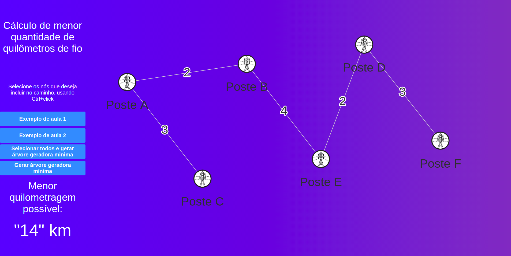
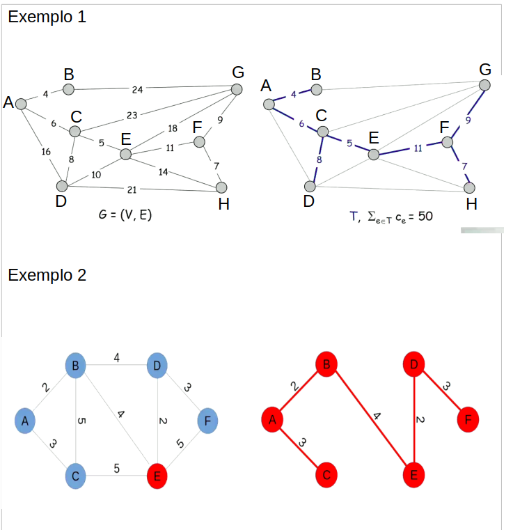

# Fiação Elétrica

**Número da Lista**: 2 
**Conteúdo da Disciplina**: Grafos 2 

## Alunos
|Matrícula | Aluno |
| -- | -- |
| 16/0111978  |  André Eduardo |
| 16/0112974  |  Arthur Rodrigues |

## Sobre 

Pode ser acessado no link: https://projeto-de-algoritmos.github.io/Grafos2_FiacaoEletrica/

Link para o vídeo explicativo: https://www.youtube.com/watch?v=RVtvnRWul3M&feature=youtu.be

O projeto implementa o algoritmo de Prim (boa implementação), que ajuda uma companhia elétrica a gastar menos com fiação. Os vértices serão como os postes e as arestas como a fiação. A partir do grafo gerado é gerada a árvore geradora mínima que contabiliza o menor custo para abranger todos os postes com a menor quantidade de fio.

## Screenshots
Imagem 1 - Tela inicial

É gerado um grafo aleatório 

 
Como percebemos, o grafo gerado não é fortemente conectado, então para gerar a árvore será necessário selecionar (Ctrl + Click) nós que estejam conectados.

Imagem 2 - Selecionando os vertices e apertando em Gerar árvore geradora mínima:

Imagem 3 - [Exemplo 1](###exemplos) da aula:

Imagem 4 - Apertando em Selecionar todos e gerar árvore geradora mínima:

Imagem 5 - [Exemplo 2](###exemplos) da aula:

Imagem 6 - Após clicar em Selecionar todos e gerar árvore geradora mínima. [Exemplo 2](###exemplos) da aula:

## Instalação 
**Linguagem**: Javascript 
**Framework**: React 
**Pacotes** : react-graph-vis

Primeiramente utilizaremos a ferramenta [git](https://git-scm.com/downloads) que é necessária para clonar o repositório:

    $ git clone https://github.com/projeto-de-algoritmos/Grafos2_FiacaoEletrica

Após clonar o repositório, é preciso acessar a pasta raiz do projeto:

    Exemplo para o linux:

    $ cd Grafos2_FiacaoEletrica

Para rodar o projeto é necessário ter instalado o [yarn](https://classic.yarnpkg.com/pt-BR/docs/install/#debian-stable) na versão estável mais atual.

Após instalar o yarn, vamos instalar as dependências do projeto.

    Na pasta raiz, execute:

    $ yarn install

Depois, subir o servidor:

    $ yarn start

E então acessar no navegador:

    http://localhost:3000/

## Uso 
Ao abrir o projeto no navegador com o link acima, automaticamente é gerado um grafo aleatório onde é possível selecionar os vértices(representando os postes) e arestas(representando os fios) apertando (Ctrl + Click), **onde só devera ser selecionado as arestas entre os vértices selecionados**. Devido a limitações da biblioteca, quando um nó é selecionado ele seleciona as arestas para os nós vizinhos desse nó, por essa questão deve se excluir as arestas para os nós que não serão selecionados. Um exemplo de correta utilização pode ser visto nas [screenshots](##screenshots) ou no [vídeo](https://www.youtube.com/watch?v=RVtvnRWul3M&feature=youtu.be).

### Exemplos

É possível escolher os grafos dados como exemplo na aula do professor, que são: 

Nesse caso aparece a opção de selecionar todos os nós e gerar a árvore a partir deles (apertando em: Selecionar todos e gerar árvore geradora minima), mas também pode ser selecionado uma a um.

## Outros 
Quaisquer outras informações sobre seu projeto podem ser descritas abaixo.

